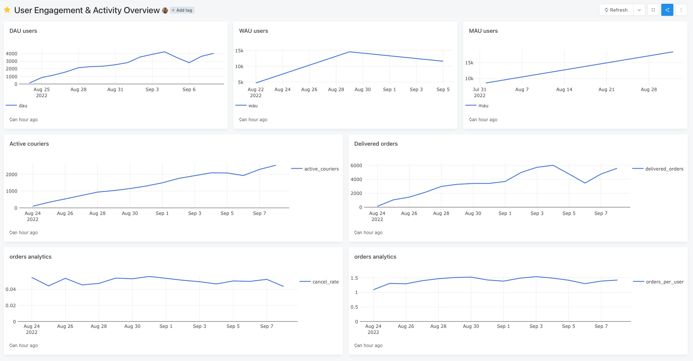
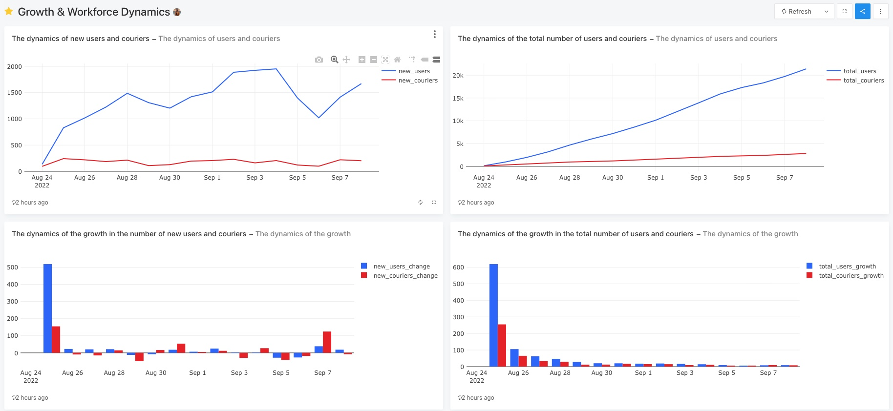
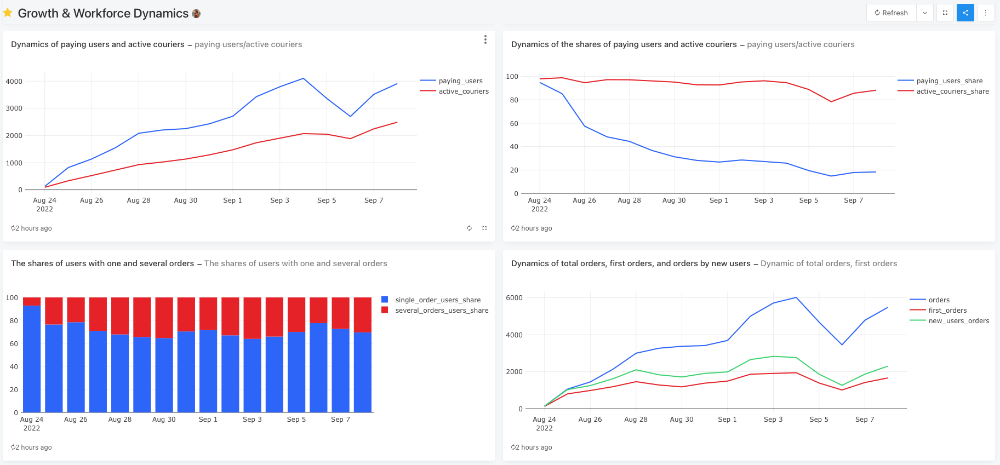
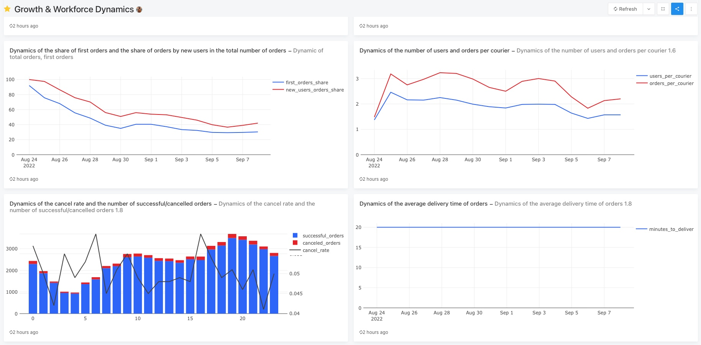
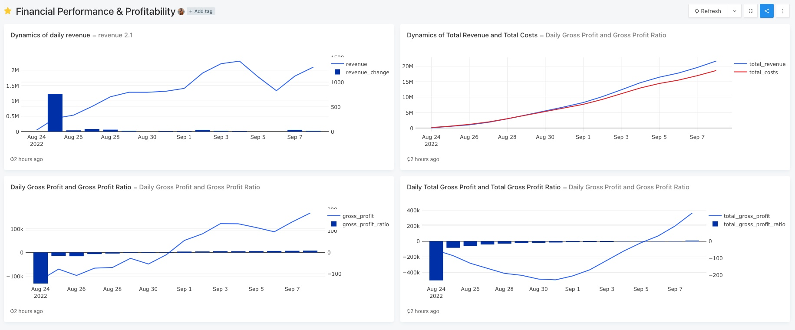
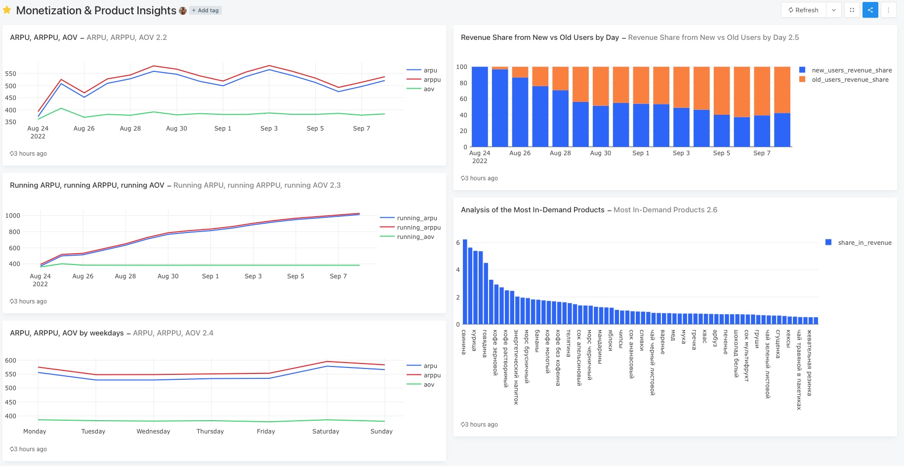
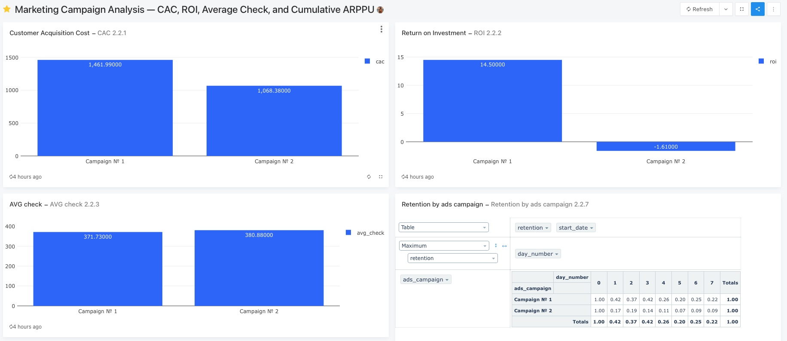
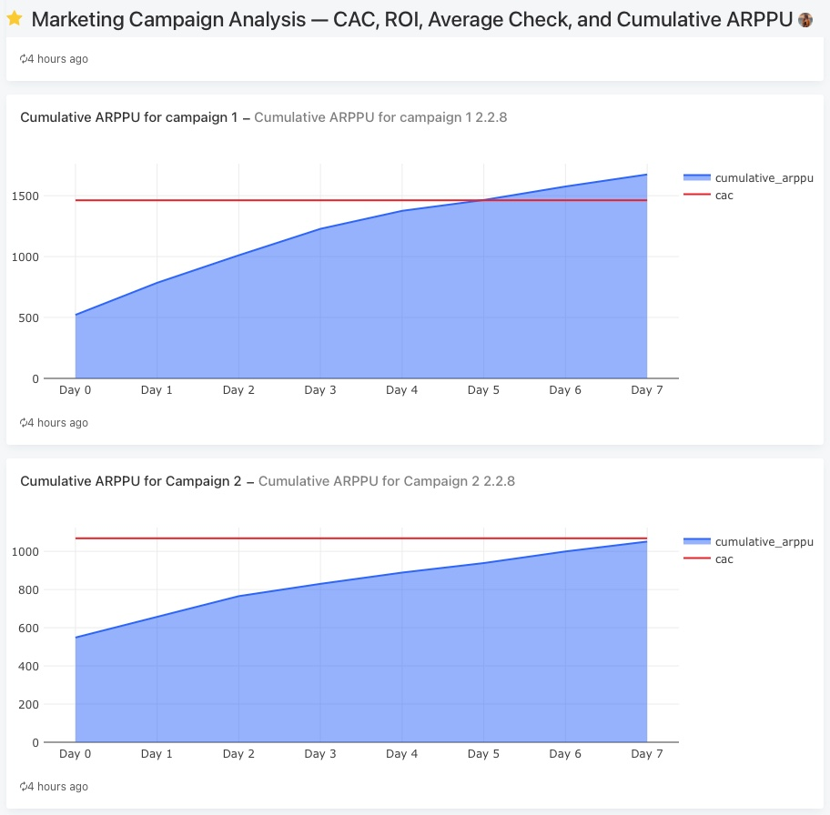
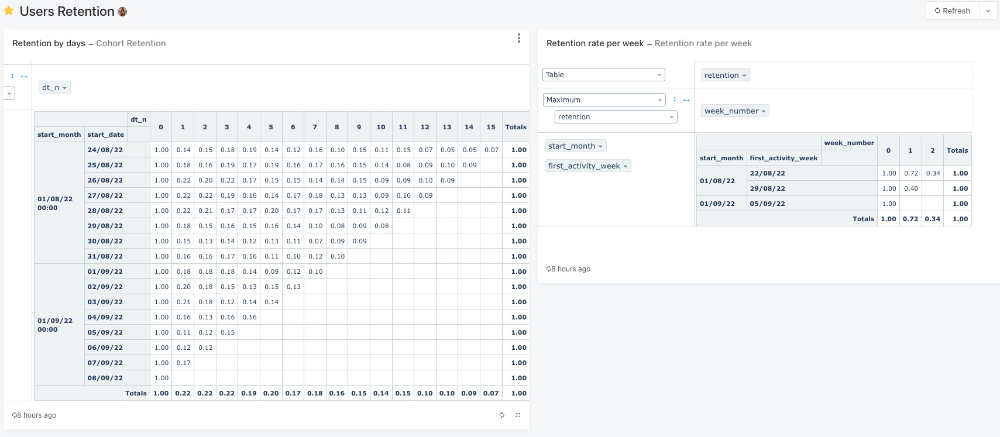

# 💼 KPI Analysis Project


## 📚 Table of Contents

- [🎯 Introduction](#🎯-introduction)
- [🧠 Background](#🧠-background)
- [🛠️ Tools I used](#🛠️-tools-i-used)
- [📊 The Analysis](#📊-the-analysis)
  - [1. User Engagement and Activity Overview](https://github.com/viktoriiaurus/KPI_metrics/tree/main#1-user-engagement--activity-overview)
  - [2. Growth & Workforce Dynamics](https://github.com/viktoriiaurus/KPI_metrics/tree/main#2-growth--workforce-dynamics)
  - [3. Financial Performance & Profitability](https://github.com/viktoriiaurus/KPI_metrics/tree/main#3-financial-performance--profitability)
  - [4. Monetization & Product Insights](https://github.com/viktoriiaurus/KPI_metrics/tree/main#4-monetization--product-insights)
  - [5. Marketing Campaign Analysis — CAC, ROI, Average Check, and Cumulative ARPPU](https://github.com/viktoriiaurus/KPI_metrics/tree/main#5-marketing-campaign-analysis--cac-roi-average-check-and-cumulative-arppu)
  - [6. Users Retention](https://github.com/viktoriiaurus/KPI_metrics/tree/main#6-users-retention)
- [🧠 What I Learned](#🧠-what-i-learned)
- [✅ Closing Thoughts](#✅-closing-thoughts)

## 🎯 Introduction

In this project, I conducted a comprehensive analysis of KPI using synthetic data simulating the operations of a delivery service. My goal was to demonstrate skills in SQL, data analysis, and visualization of key business metrics through a series of dashboards.
I organized the entire analysis into six logical blocks that progressively reveal user dynamics, activity, financial performance, marketing effectiveness, and customer retention. 


## 🧠 Background

The data models the delivery operation with entities such as users, couriers, orders, marketing campaigns, and finances. While analyzing these data, I aimed to answer several important business questions:
	•	What is the activity level of users and couriers across different time periods?
	•	How is the user and courier base growing?
	•	How is the financial performance of the service developing?
	•	What is the effectiveness of marketing campaigns?
	•	What does user retention look like?


## 🛠️ Tools I Used

- **SQL & PostgreSQL:** Data querying and transformation  
- **Visual Studio Code:** SQL editing and project organization  
- **Redash:** Dashboarding and visualization  
- **Git & GitHub:** Version control and project management

## 📊 The Analysis  
### 1. User Engagement and Activity Overview


*[User Engagement & Activity Overviews](https://redash.public.karpov.courses/public/dashboards/mLxC2Th1LQLXCxiUjJ3D3GJBQ29yMTEbjGxtLiY6?org_slug=default)*

*Below is a list of the key dashboard metrics. Click on each metric name to expand the detailed analysis.*

- <details>
  <summary><strong>DAU (Daily Active Users)</strong></summary>

  **Analysis:**  
  Daily active users demonstrate steady growth throughout the analyzed period, rising from zero to over 4,000 active users per day. This indicates successful acquisition of new customers and sustained engagement of existing ones.  
  Note that a slight dip in activity around September 6 might be related to external factors such as holidays or technical issues, which warrant further investigation.

  **Key point:** Daily activity is one of the most sensitive metrics, reacting immediately to changes in user behavior.

  **Recommendations:**  
  - Actively segment users to identify the most loyal groups and encourage retention through personalized offers.  
  - Analyze days with activity drops, including checks for seasonality, technical problems, and external events — this analysis can be deepened in Dashboard 6 (Users Retention), which focuses on retention metrics.

  </details>

```sql
  SELECT
  time :: date as date,
  count(distinct user_id) as dau 
  FROM
    user_actions
  GROUP BY
  date;
```

- <details>
  <summary><strong>WAU (Weekly Active Users)</strong></summary>
  **Analysis:**  
  Weekly active users increase from 5,000 to a peak of around 15,000 users, followed by a slight decline. This trend confirms the growth of the active user base but signals a possible loss of interest among some users.

  **Key point:** WAU is a more inertial metric reflecting a broader user base, and changes here occur more slowly. Declines may indicate user churn or increased competition.

  **Recommendations:**  
  - Conduct additional analysis of the reasons for the decline — it could be seasonality, competing offers, or suboptimal user experience. Note that basic user retention analysis is covered in Dashboard 6.  
  - Implement retention-focused marketing campaigns, especially targeting segments with lower activity.

  <small>  [SQL query for WAU](./sql_project/user_engagement_&_activity/wau.sql) </small>

  </details>

- <details>
  <summary><strong>MAU (Monthly Active Users)</strong></summary>

  **Analysis:**  
  Monthly active users show stable growth, indicating effective audience scaling. The longer time horizon allows visualization of the overall growth trend.

  **Recommendations:**  
  - Continue improving service quality to sustain positive growth.  
  - Consider that monthly metrics are less sensitive to short-term changes, so they should be analyzed alongside daily and weekly data for a comprehensive view.

   <small>  [SQL query for MAU](./sql_project/user_engagement_&_activity/mau.sql) </small>

  </details>

- <details>
  <summary><strong>Active Couriers</strong></summary>

  **Analysis:**  
  Courier activity steadily rises, reaching over 2,000 active couriers by the end of the period. This is critical for ensuring timely delivery and meeting user demand.

  **Key point:** Courier growth should lag or match user growth to avoid excessive downtime or overloading.

  **Recommendations:**  
  - Analyze courier efficiency (e.g., average orders per courier). I started this analysis in Dashboard 2, which tracks orders per courier.  
  - Develop predictive models to plan courier staffing based on order and user dynamics.

   <small>  [SQL query for active couriers](./sql_project/user_engagement_&_activity/active_couriers.sql) </small>

  </details>

- <details>
  <summary><strong>Delivered Orders</strong></summary>

  **Analysis:**  
  The number of delivered orders shows a positive trend, correlating with the growth of users and couriers. Small dips (e.g., September 5) may indicate technical disruptions, weather conditions, or seasonal fluctuations.

  **Recommendations:**  
  - Implement alert and monitoring systems to quickly respond to volume decreases.  
  - Perform deeper analysis of dip causes, possibly leveraging financial metrics from Dashboard 3 and monetization data from Dashboard 4.

   <small>  [SQL query for deliverd orders](./sql_project/user_engagement_&_activity/delivered_orders.sql) </small>

  </details>

- <details>
  <summary><strong>Cancel Rate</strong></summary>

  **Analysis:**  
  The order cancellation rate remains steadily low at around 4-5%, which is a good indicator of service quality.

  **Key point:** A low cancellation rate positively impacts profitability and customer experience.

  **Recommendations:**  
  - Continue monitoring to prevent increases in this rate.  
  - Further analyze cancellation causes by region or time (partially covered in Dashboards 2 and 4).

  </details>

```sql
SELECT
    round(cancel_orders::decimal / create_orders, 2) as cancel_rate,
    date
from    
(SELECT
  count(order_id) filter(where action = 'cancel_order') as cancel_orders,
  count(order_id) filter(where action = 'create_order') as create_orders,
  time :: date as date
from
  user_actions
group by
  date) t1;
```
- <details>
  <summary><strong>Orders per User</strong></summary>

  **Analysis:**  
  The average number of orders per user hovers around 1 to 1.5, indicating moderate customer loyalty.

  **Recommendations:**  
  - Implement mechanisms to increase repeat orders such as loyalty programs, personalized offers, and email campaigns.  
  - Segment users by activity level to target promotions effectively toward less active customers.

   <small>  [SQL query for orders per user](./sql_project/user_engagement_&_activity/orders_analytics.sql) </small>

  </details>

---

#### Overall Conclusions for Dashboard 1:
User and courier activity are increasing, reflecting service growth and expanding the customer base. A consistently low cancellation rate is a strong business advantage. However, the orders-per-user metric suggests potential for improving loyalty, which should be addressed in upcoming marketing strategies.
 
---

### 2. Growth & Workforce Dynamics


*[Growth & Workforce Dynamics 1](https://redash.public.karpov.courses/public/dashboards/2eWYTjm2aYiDzprispvzRpo0KfwR7mcXjfWUXk1I?org_slug=default)*

*Below is the list of key metrics for this dashboard. Click on each metric name to expand detailed analysis. Summary conclusions follow at the end.*

- <details>
  <summary><strong>Chart 1: Dynamics of New Users and Couriers (new_users, new_couriers)</strong></summary>

  **Analysis:**  
  New users grow significantly faster than new couriers. During the period, the number of new users reaches about 2,000 per day, while new couriers only about 200–240. This indicates that customer acquisition is very effective, but the expansion of the courier network lags behind.

  **Recommendations:**  
  - Accelerate courier recruitment to avoid delivery delays, worsening customer experience, and increased cancellations.  
  - Expand marketing and recruitment campaigns focused specifically on couriers.

</details>

```sql
SELECT
    date,
    new_users,
    new_couriers,
    sum(new_users) OVER(order by date)::integer as total_users,
    sum(new_couriers) OVER(order BY date)::integer as total_couriers
FROM    (SELECT
        user_activities.first_active_date AS date,
        COUNT(DISTINCT user_activities.user_id) AS new_users,
        COUNT(DISTINCT courier_activities.courier_id) AS new_couriers
    FROM (
        SELECT
            user_id,
            MIN(time::date) AS first_active_date
        FROM user_actions
        GROUP BY user_id
    ) AS user_activities
    LEFT JOIN (
        SELECT
            courier_id,
            MIN(time::date) AS first_active_date
        FROM courier_actions
        GROUP BY courier_id
    ) AS courier_activities
    ON user_activities.first_active_date = courier_activities.first_active_date
    GROUP BY user_activities.first_active_date
    ORDER BY user_activities.first_active_date) t1

```

- <details>
  <summary><strong>Chart 2: Total Users and Couriers (total_users, total_couriers)</strong></summary>

  **Analysis:**  
  The total number of users shows stable and consistent growth, indicating business scaling. Courier numbers also grow, but much more slowly, highlighting the existing imbalance.

  **Recommendations:**  
  - Given the trend, it is important to plan increasing courier numbers to avoid delays and negative feedback.

  <small>  [SQL query for total users and couriers](./sql_project/growth_&_workforce_dynamics/new_users_&_couriers.sql) </small>

</details>

- <details>
  <summary><strong>Chart 3: The dynamics of the growth</strong></summary>

  **Analysis:**  
  Data show that growth rates of new users fluctuate sharply, sometimes decreasing, while changes in courier numbers are smoother but occasionally spike on certain days. This means courier recruitment responds more slowly to demand changes.

  **Recommendations:**  
  - Implement forecasting systems to better respond to demand surges.  
  - Optimize the courier recruitment process to reduce time from hiring decision to start of work.

  <small>  [SQL query for dynamics of the growth (new users and couriers)](./sql_project/growth_&_workforce_dynamics/growth_dynamics.sql) </small>

</details>

- <details>
  <summary><strong>Chart 4: Changes in Total Users and Couriers (total_users_growth, total_couriers_growth)</strong></summary>

  **Analysis:**  
  Total user growth outpaces courier growth by a large margin, which may indicate a potential scaling problem.

  **Recommendations:**  
  - To balance the system, develop courier motivation programs, improve working conditions and earning opportunities.  
  - Consider this imbalance in service development and marketing plans.

  <small>  [SQL query for dynamics of the growth (total users and couriers)](./sql_project/growth_&_workforce_dynamics/growth_dynamics.sql) </small>

</details>


*[Growth & Workforce Dynamics 2](https://redash.public.karpov.courses/public/dashboards/2eWYTjm2aYiDzprispvzRpo0KfwR7mcXjfWUXk1I?org_slug=default)*

- <details>
  <summary><strong>Charts 5-6: Dynamics and Share of Paying Users and Active Couriers</strong></summary>

  **Analysis:**  
  The number of paying users grows faster than couriers. The declining share of paying users relative to active couriers may signal user loss or changes in payment ability.

  **Recommendations:**  
  - Focus on retaining paying users through service improvement and personalized offers.  
  - Develop strategies to convert free users into paying users (e.g., promotions, feature restrictions for free users).

</details>

```sql
SELECT date,
       paying_users,
       active_couriers,
       round(100 * paying_users::decimal / total_users, 2) as paying_users_share,
       round(100 * active_couriers::decimal / total_couriers, 2) as active_couriers_share
FROM   (SELECT start_date as date,
               new_users,
               new_couriers,
               (sum(new_users) OVER (ORDER BY start_date))::int as total_users,
               (sum(new_couriers) OVER (ORDER BY start_date))::int as total_couriers
        FROM   (SELECT start_date,
                       count(courier_id) as new_couriers
                FROM   (SELECT courier_id,
                               min(time::date) as start_date
                        FROM   courier_actions
                        GROUP BY courier_id) t1
                GROUP BY start_date) t2
            LEFT JOIN (SELECT start_date,
                              count(user_id) as new_users
                       FROM   (SELECT user_id,
                                      min(time::date) as start_date
                               FROM   user_actions
                               GROUP BY user_id) t3
                       GROUP BY start_date) t4 using (start_date)) t5
    LEFT JOIN (SELECT time::date as date,
                      count(distinct courier_id) as active_couriers
               FROM   courier_actions
               WHERE  order_id not in (SELECT order_id
                                       FROM   user_actions
                                       WHERE  action = 'cancel_order')
               GROUP BY date) t6 using (date)
    LEFT JOIN (SELECT time::date as date,
                      count(distinct user_id) as paying_users
               FROM   user_actions
               WHERE  order_id not in (SELECT order_id
                                       FROM   user_actions
                                       WHERE  action = 'cancel_order')
               GROUP BY date) t7 using (date);
```

- <details>
  <summary><strong>Chart 7: Share of Users with One and Multiple Orders</strong></summary>

  **Analysis:**  
  Most users (over 80%) make only one order. The share of repeat users is about 20%, which is relatively low for steady revenue.

  **Recommendations:**  
  - Implement loyalty programs and incentives for repeat orders.  
  - Segment users to identify those who do not return and address their barriers.

  <small>  [SQL query for Share of Users with One and Multiple Orders](./sql_project/growth_&_workforce_dynamics/one_several_orders.sql) </small>

</details>

- <details>
  <summary><strong>Charts 8-9: Dynamics of Total Orders, First Orders, and Orders by New Users</strong></summary>

  **Analysis:**  
  Total orders are increasing, notably due to new users. However, the share of first orders and orders from new users gradually decreases over time, naturally reflecting the formation of a stable client base.

  **Recommendations:**  
  - Monitor new user acquisition to prevent decline and maintain balance between acquisition and retention.  
  - Implement programs encouraging new users to make second and third orders (converting them to repeat customers).
  
  <small>  [SQL query for Dynamics of Total Orders, First Orders, and Orders by New Users](./sql_project/growth_&_workforce_dynamics/first_orders.sql) </small>

</details>


*[Growth & Workforce Dynamics 3](https://redash.public.karpov.courses/public/dashboards/2eWYTjm2aYiDzprispvzRpo0KfwR7mcXjfWUXk1I?org_slug=default)*

- <details>
  <summary><strong>Chart 10: Dynamics of Users and Orders per Courier (users_per_courier, orders_per_courier)</strong></summary>

  **Analysis:**  
  Orders per courier significantly increase by the end of August, possibly due to route optimization or increased productivity. Users per courier remain stable.

  **Recommendations:**  
  - Investigate causes of increased courier workload and assess burnout risks.  
  - Conduct regular performance monitoring of couriers for optimal order distribution.

  <small>  [SQL query for Dynamics of users and orders per courier](./sql_project/growth_&_workforce_dynamics/orders_per_courier.sql) </small>

</details>

- <details>
  <summary><strong>Chart 11: Successful and Canceled Orders</strong></summary>

  **Analysis:**  
  The chart shows a consistently high level of successful orders, significantly exceeding cancellations which remain around 4-5%. This indicates effective operational performance and customer satisfaction.

  **Key insight:** Stability of this ratio is critical for financial stability. Excessive cancellations would negatively affect revenue and reputation.

  **Recommendations:**  
  - Continue monitoring cancellation reasons by categories (time of day, region, courier).  
  - Take measures to reduce cancellations, such as improving customer communication and optimizing logistics.

  <small>  [SQL query for successful and canceled orders](./sql_project/growth_&_workforce_dynamics/successful_&_cancelled_orders.sql) </small>

</details>

- <details>
  <summary><strong>Chart 12: Delivery Time Dynamics</strong></summary>

  **Analysis:**  
  Delivery time remains stable, indicating stable logistical processes despite increasing workload.

  **Recommendations:**  
  - Maintain this level through continuous operational improvements.

  <small>  [SQL query for delivery time](./sql_project/growth_&_workforce_dynamics/delivery_time.sql) </small>

</details>

---

### Overall Conclusions for Dashboard 2:

This dashboard clearly illustrates rapid user base growth and a less dynamic but steady increase in the courier network. The imbalance between demand and supply may create logistical issues that should be timely identified and minimized.

Low repeat order rates and declining paying user share indicate the need to improve marketing and product strategies for retention and monetization.

---

### 3. Financial Performance & Profitability


*[Financial Performance & Profitability](https://redash.public.karpov.courses/public/dashboards/bnvG9zqf52vr448TUXKvUUi5ILTanPEm5Y45Vskg?org_slug=default)*

*Below is the list of key metrics for this dashboard. Click on each metric name to expand detailed analysis. Summary conclusions follow at the end.*

- <details>
  <summary><strong>Chart 1: Daily Revenue</strong></summary>

  **Analysis:**  
  Revenue shows gradual growth with minor fluctuations, which may be related to seasonality or changes in users’ purchasing power. Overall, the trend is positive, indicating successful monetization and business growth.

  **Key insight:** Revenue growth directly correlates with an increase in paying users and order volume, as reflected in previous dashboards.

  **Recommendations:**  
  - Continue to stimulate paying user growth through marketing campaigns.  
  - Analyze periods of revenue decline to identify underlying causes.

</details>

```sql
with pr_id as(
  select 
      order_id,
      creation_time::date as date,
      unnest(product_ids) as product_id
  from orders
  where order_id not in (select order_id from user_actions where action =  'cancel_order')
)

select
    date,
    revenue,
    total_revenue,
    round((revenue - lag(revenue) OVER(ORDER BY date))*100 / lag(revenue) OVER(ORDER BY date)::decimal, 2) as revenue_change
from (select
        date,
        revenue,
        sum(revenue) OVER(ORDER BY date) as total_revenue
      from (select
            date,
            sum(p.price)  as revenue
            from pr_id
            left join products as p using(product_id)
            group by date
            order by date) t1
      ) t2;
```

- <details>
  <summary><strong>Chart 2: Total Revenue and Total Costs</strong></summary>

  **Analysis:**  
  Costs grow more slowly than revenue, which is a positive sign of operational expense control. However, occasional cost spikes may indicate temporary investments or unexpected expenses.

  **Recommendations:**  
  - Conduct a detailed analysis of cost structure.  
  - Optimize costs focusing on marketing and operational efficiency.

  <small>  [SQL query for Total Revenue and Total Costs](./sql_project/financial_performance_&_profitability/gross_profit.sql) </small>

</details>

- <details>
  <summary><strong>Chart 3: Gross Profit</strong></summary>

  **Analysis:**  
  Gross profit fluctuates but trends upward, turning positive since early September. This indicates the business is beginning to effectively cover its costs.

  **Key insight:** Gross profit is the foundation for further profitability assessment, representing revenue minus direct costs.

  **Recommendations:**  
  - Focus on increasing gross profit by boosting revenue and optimizing product/service costs.  
  - Analyze periods of negative gross profit to detect and resolve issues.

  <small>  [SQL query for gross profit](./sql_project/financial_performance_&_profitability/gross_profit.sql) </small>

</details>

- <details>
  <summary><strong>Chart 4: Total Gross Profit</strong></summary>

  **Analysis:**  
  This chart shows cumulative gross profit over the entire period, reflecting the total financial result of the business. A clear upward trend indicates steady financial improvement.

  **Recommendations:**  
  - Use this metric for strategic planning and evaluating investment opportunities.  
  - Monitor to ensure cumulative gross profit growth does not slow or decline, which may signal problems.

  <small>  [SQL query for total gross profit](./sql_project/financial_performance_&_profitability/gross_profit.sql) </small>

</details>

---

#### Overall Conclusions for Dashboard 3:

Financial metrics indicate steady revenue growth alongside controlled costs, leading to positive gross profit and improving financial stability. The cumulative gross profit confirms that the company is developing consistently and moving towards profitability.

---
  
### 4. Monetization & Product Insights


*[Monetization & Product Insights](https://redash.public.karpov.courses/public/dashboards/dNoMobOzhrFBElg5kNfeyp7oIi9oV7OOl7wCpj9J?org_slug=default)*

*Below is the list of key metrics for this dashboard. Click on each metric name to expand detailed analysis. Summary conclusions follow at the end.*

- <details>
  <summary><strong>Chart 1: ARPU, ARPPU, AOV</strong></summary>

  **Analysis:**  
  ARPPU (Average Revenue Per Paying User) is always higher than ARPU (Average Revenue Per User), since ARPU includes all users, including free ones, while ARPPU counts only paying users. A large gap between ARPU and ARPPU indicates that paying users constitute a relatively small portion of the total user base.  
  AOV (Average Order Value) shows the average cost of a single order and remains stable over time, indicating that revenue growth occurs mainly through an increase in the number of orders or conversion of users into paying customers, rather than an increase in average order price.

  **Recommendations:**  
  - Focus on increasing the share of paying users to reduce the gap between ARPU and ARPPU.  
  - Implement incentives to convert free users into paying users.  
  - Maintain AOV stability while encouraging more frequent orders.

</details>

```sql
with rev as (
 select
            date,
            sum(p.price)  as revenue
        from (select 
                order_id,
                creation_time::date as date,
                unnest(product_ids) as product_id
              from orders
              where order_id not in (select order_id from user_actions where action = 'cancel_order')) pr_id
        left join products as p using(product_id)
        group by date
        order by date
),
users_count as (
    select 
    time::date as date,
    count(DISTINCT user_id) as user_count
    from user_actions
    group by date
),
paying_us as (
    select
        time::date as date,
        count(DISTINCT user_id) as paying_user
    from user_actions
    where order_id not in (select order_id from user_actions where action = 'cancel_order')
    group by date
),
orders_count as(
    select
        creation_time::date as date,
        count(distinct order_id) as order_count
    from orders
    where order_id not in (select order_id from user_actions where action = 'cancel_order')
    group by date
)

select 
    date,
    round(revenue::decimal / uc.user_count, 2) as arpu,
    round(revenue::decimal / pu.paying_user, 2) as arppu,
    round(revenue::decimal / oc.order_count, 2) as aov
from rev
left join users_count uc using(date)
left join paying_us pu using(date)
left join orders_count oc using(date)
order by date;
```

- <details>
  <summary><strong>Chart 2: Running ARPU, Running ARPPU, Running AOV</strong></summary>

  **Analysis:**  
  “Running” metrics are cumulative values over time, showing the total average revenue per user or paying user from the start of the period up to the current date. Unlike regular ARPU/ARPPU which show daily or periodic snapshots, running ARPU/ARPPU demonstrate long-term trends in accumulated revenue.  
  Growth in running ARPU and running ARPPU indicates gradual improvement in user monetization and increasing revenue from paying users over the long term. Stable running AOV confirms that average order value remains steady and revenue growth is driven by more orders or a growing paying user base.

  **Recommendations:**  
  - Use running metrics for long-term analysis of marketing and monetization effectiveness.  
  - Continue efforts to boost paying user activity and conversion rates.  
  - Monitor deviations in accumulated revenue to detect potential issues.

  <small>  [SQL query for running arpu/arppu/aov](./sql_project/monetization_&_product_insights/running_arpu_arppu_aov.sql) </small>

</details>

- <details>
  <summary><strong>Chart 3: ARPU, ARPPU, AOV by weekdays</strong></summary>

  **Analysis:**  
  ARPU and ARPPU values are fairly stable during the week, with a noticeable increase on weekends indicating higher paying user activity on those days. AOV remains consistent, allowing identification of peak demand periods for targeted marketing.

  **Recommendations:**  
  - Conduct targeted marketing campaigns and promotions during weekends to maximize revenue.  
  - Analyze user behavior by weekday to optimize offers.

  <small>  [SQL query for arpu/arppu/aov by weekdays](./sql_project/monetization_&_product_insights/weekday_arpu_arppu_aov.sql) </small>

</details>

- <details>
  <summary><strong>Chart 4: Revenue Share from New vs Old Users by Day</strong></summary>

  **Analysis:**  
  Revenue from new users remains steady during the first two weeks after service launch but gradually decreases over time. This typical pattern for a growing service shows the stable user base starts to generate a larger portion of revenue.

  **Recommendations:**  
  - Maintain balance between acquiring new users and retaining existing ones.  
  - Implement loyalty programs to convert new users into regular customers.

  <small>  [SQL query for revenue share](./sql_project/monetization_&_product_insights/revenue_share.sql) </small>

</details>

- <details>
  <summary><strong>Chart 5: Analysis of the Most In-Demand Products</strong></summary>

  **Analysis:**  
  The chart highlights which products generate the largest share of revenue. A small number of top products account for a significant portion of total revenue.

  **Recommendations:**  
  - Focus marketing and operational efforts on top-performing products.  
  - Regularly analyze assortment and adjust offerings based on demand.

  <small>  [SQL query for the most in demand products](./sql_project/monetization_&_product_insights/in_demand_products.sql) </small>

</details>

---

### Overall Conclusions for Dashboard 4:

This dashboard provides a comprehensive understanding of monetization processes through key metrics ARPU, ARPPU, AOV, and their running variants. The analysis of revenue distribution between new and existing users helps effectively plan user acquisition and retention strategies. Focusing on products helps optimize the assortment and increase revenue.

---
 
### 5. Marketing Campaign Analysis — CAC, ROI, Average Check, and Cumulative ARPPU


*[Marketing Campaign Analysis](https://redash.public.karpov.courses/public/dashboards/gYOZzbmE8BKEW2tofcYRTRWAcZAmndDbTlt4LtCR?org_slug=default)*

*Below is the list of key metrics for this dashboard. Click on each metric name to expand detailed analysis. Summary conclusions follow at the end.*

- <details>
  <summary><strong>Chart 1: Customer Acquisition Cost (CAC)</strong></summary>

  **Analysis:**  
  CAC for Campaign 1 (~1462 conditional units) is significantly higher than for Campaign 2 (~1068 conditional units), indicating higher costs to acquire each customer in Campaign 1. However, CAC alone doesn’t reflect campaign efficiency without considering profitability and retention.  

  **Recommendations:**  
  - Combine CAC analysis with ROI and retention metrics to get a full picture of campaign effectiveness.  
  - For Campaign 1, maintain strict control over CAC growth and ensure that budget optimizations are tested to avoid spending more without proportional revenue gains.  
  - Link these insights to retention data analyzed in Dashboard 6 to assess lifetime value of acquired users.

  <small>  [SQL query for CAC](./sql_project/marketing_campaign/cac.sql) </small>

</details>

- <details>
  <summary><strong>Chart 2: Return on Investment (ROI)</strong></summary>

  **Analysis:**  
  Campaign 1 delivers a substantial positive ROI (+14.5%), demonstrating profitability and effective investment recovery. Campaign 2 has a negative ROI (-1.61%), currently operating at a loss.

  **Recommendations:**  
  - Focus efforts on scaling Campaign 1 while continuously monitoring its ROI to sustain profitability.  
  - For Campaign 2, conduct deeper analysis on cost structure and campaign targeting to improve returns or consider reallocating budget.

  <small>  [SQL query for ROI](./sql_project/marketing_campaign/roi.sql) </small>

</details>

- <details>
  <summary><strong>Chart 3: Average Check (AVG Check)</strong></summary>

  **Analysis:**  
  Both campaigns show similar average check values, with Campaign 2 slightly higher (~381 vs ~372 conditional units). This indicates that users from Campaign 2 tend to spend a bit more per order despite the campaign’s negative ROI.

  **Recommendations:**  
  - Investigate user behavior patterns in Campaign 2 to understand why higher spending per order doesn’t translate into profitability — potentially due to low retention or high acquisition costs.  
  - Integrate these findings with user frequency and retention analysis from Dashboards 2 and 6 for a holistic view.
  
  <small>  [SQL query for AVG check](./sql_project/marketing_campaign/avg_check.sql) </small>

</details>

- <details>
  <summary><strong>Chart 4: Retention by Ads Campaign</strong></summary>

  **Analysis:**  
  Campaign 1 shows superior retention rates, meaning users stay active longer and generate sustained revenue. Campaign 2 exhibits significantly lower retention, adversely impacting its long-term profitability.

  **Recommendations:**  
  - Enhance retention strategies for Campaign 2, including loyalty programs, personalized messaging, or incentives.  
  - Segment low-retention users to identify barriers to repeat engagement and address them in marketing plans.

  <small>  [SQL query for Retention](./sql_project/marketing_campaign/retention.sql) </small>

</details>


*[Marketing Campaign Analysis](https://redash.public.karpov.courses/public/dashboards/gYOZzbmE8BKEW2tofcYRTRWAcZAmndDbTlt4LtCR?org_slug=default)*

- <details>
  <summary><strong>Chart 5 & 6: Cumulative ARPPU for Campaigns 1 and 2</strong></summary>

  **What is Cumulative ARPPU?**  
  Cumulative ARPPU (Average Revenue Per Paying User) measures the total accumulated revenue per paying user over time, showing how quickly user revenue recovers the acquisition cost (CAC). Unlike standard ARPPU, which is a snapshot average, cumulative ARPPU tracks the dynamic progression of returns from user investments.  

  **Analysis:**  
  Campaign 1 reaches and surpasses the CAC break-even point within the first week, demonstrating fast recovery of marketing investments. Campaign 2 remains below break-even, with cumulative revenue per user insufficient to cover CAC.  

  **Recommendations:**  
  - Monitor cumulative ARPPU trends to assess the effectiveness of campaign changes on investment recovery speed.  
  - Experiment with targeting, offers, and cost models for Campaign 2 to improve its cumulative revenue trajectory.  
  - Cross-reference with retention insights from Dashboard 6 for integrated strategy refinement.

  <small>  [SQL query for Cumulative ARPPU](sql_project/marketing_campaign/cumulative_arppu.sql) </small>

</details>

---

### Overall Conclusions for Dashboard 5:

This dashboard offers vital insights into the efficiency and profitability of marketing campaigns in the context of user acquisition costs, revenue per user, and retention patterns highlighted in previous dashboards. While Campaign 1 incurs higher acquisition costs, it achieves positive ROI and faster investment recovery due to better retention and monetization of users. Campaign 2, although cheaper to acquire users, struggles with profitability and retention, requiring strategic optimization.

---
 
### 6. Users Retention


*[Users Retention](https://redash.public.karpov.courses/public/dashboards/2CODPz9PQmqyJ8V7YbRKvVfcqmayTKyZoBSw3VPq?org_slug=default)*

*Below is the list of key metrics for this dashboard. Click on each metric name to expand detailed analysis. Summary conclusions follow at the end.*

- <details>
  <summary><strong>Chart 1: Retention by Days — Cohort Retention</strong></summary>

  **Analysis:**  
  This chart, shown as a cohort retention table, displays how user retention changes day by day after their first activity or registration. We observe a typical trend: retention peaks on day 0 (the registration day) and gradually decreases over the next two weeks. On average, about 7-15% of the initial cohort remains active by day 7. This retention level is typical for many online services, indicating that most users quickly lose interest or fail to return.
  Cohort retention analysis is essential to identify “critical” days when most users drop off and to track if there is a positive trend over time, possibly due to product improvements or marketing efforts.

</details>

```sql
SELECT date_trunc('month', start_date)::date as start_month,
       start_date,
       date - start_date as day_number,
       round(users::decimal / max(users) OVER (PARTITION BY start_date), 2) as retention
FROM   (SELECT start_date,
               time::date as date,
               count(distinct user_id) as users
        FROM   (SELECT user_id,
                       time::date,
                       min(time::date) OVER (PARTITION BY user_id) as start_date
                FROM   user_actions) t1
        GROUP BY start_date, time::date) t2;
```

- <details>
  <summary><strong>Chart 2: Retention Rate per Week</strong></summary>

  **Analysis:**  
  This table shows weekly retention rates, indicating the percentage of users from a cohort who remain active in subsequent weeks after their initial use. There is a notable drop starting from the second week, with only about 34% of users staying active, and fewer remaining active by the third week.
  Weekly retention is a critical metric for measuring user loyalty and the long-term health of the service. Low retention after the first month suggests challenges with sustaining user engagement.

</details>

```sql
SELECT 
    DATE(start_month) as start_month,  
    first_activity_week, 
    week_number, 
    retention
FROM
      (SELECT week, 
              COUNT(DISTINCT user_id) as active_users,
              ROUND(COUNT(DISTINCT user_id)::decimal / MAX(COUNT(DISTINCT user_id)) OVER(partition by first_activity_week), 2) as retention,
              first_activity_week,
              date_trunc('month', first_activity_week) as start_month,
              date_trunc('month', week) as month,
              round(EXTRACT (epoch FROM AGE(week, first_activity_week)) / (7 * 24 * 60 * 60)) as week_number 
      FROM
          (SELECT user_id, 
                  week, 
                  DATE_TRUNC('week', first_activity_day)::date as first_activity_week
          FROM
              (SELECT user_id, 
                      DATE_TRUNC('week', time) as week,
                      MIN(time::date) OVER(partition by user_id) as first_activity_day
              FROM user_actions) t1
              ) t2
          GROUP BY week, first_activity_week
          ) t3
ORDER BY first_activity_week, week_number;
```

---

### Overall Conclusions for Dashboard 6:

This dashboard illustrates a common pattern of declining user retention in the critical days and weeks after registration typical for online platforms. Understanding these retention dynamics is vital for evaluating marketing campaign performance, conversion strategies, and user experience improvements.

To maximize lifetime user value and business profitability, focus retention initiatives on the first 7 to 14 days after registration, the period with the highest user drop-off. Improving onboarding, early engagement, and timely retention efforts during this window can significantly enhance long-term loyalty and revenue growth. Regular cohort monitoring supports continuous improvement and strategic decision-making to foster sustainable user growth.


## 🧠 What I Learned

Working on this project, I deepened my skills in SQL, data analytics, and visualization of key business metrics. I learned to:

- Analyze the relationship between user and courier activity, identifying potential imbalances in operational processes.
- Perform cohort analysis of users to detect patterns of retention and churn.
- Assess the effectiveness of marketing campaigns through metrics such as CAC, ROI, and cumulative ARPPU, understanding how these relate to user acquisition and retention.
- Evaluate the service’s financial indicators, including revenues, expenses, and profitability, using comprehensive metrics.

This project helped me better understand how large datasets can be structured and analyzed to extract valuable business insights.

## ✅ Closing Thoughts
This project allowed me not only to hone technical skills in data analysis and SQL query writing but also to develop critical thinking regarding business metrics.
The results highlight the importance of balancing user acquisition and retention, as well as revenues and expenses. For the successful growth of the service, it is essential to continuously improve marketing strategies, optimize operational processes, and maintain high service quality.

Moving forward, I plan to expand my knowledge in predictive analytics and machine learning for business process optimization, as well as enhance data visualization and presentation to support strategic decision-making.